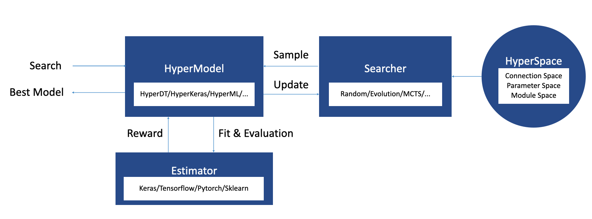

# A Brief Tutorial for Developing AutoML Tools with Hypernets

*Please see [here](https://github.com/DataCanvasIO/Hypernets) for the ```Hypernets``` library.*

Parameter tuning is an inevitable step for successfully building a machine learning model. Even for a simple model as K-nearest neighbors(KNN) for the classification task, we need to at least determine the number of the neighbors and the distance metric to be used to predict the label of a given example. Let alone models which have much more tunable parameters and have to be trained multiple times before we can pick suitable values for their parameters. Furthermore, tuning parameters in a brute force approach is inefficient while using an advanced search method takes intensive efforts. Can we focus more on parts of machine learning like designing novel models while only performing procedures like parameter tuning in a simple and happy way?

The answer is positive.

```Hypernets```, a unified Automated Machine learning(AutoML) framework, offers us a very simple way to solve such problems. Taking the parameter tuning problem of the KNN model as an example, using a ```search_param``` function from the ```Hypernets```, the only required work for us is to define a function serving as the measure of the quality of a set of given parameters. 

```python
from sklearn import neighbors

def score_function(X_train, y_train, X_evl, y_evl, 
                   n_neighbors=Choice([3, 5, 6, 10, 20]),
                   weights=Choice(['uniform', 'distance']),
                   algorithm=Choice(['auto', 'ball_tree', 'kd_tree', 'brute']),
                   leaf_size=30,
                   p=Choice([1, 2])):
    # The avaliable values for each tunable parameter are those provided by the list
    # elements of the argument of Choice(). For example, the parameter "n_neighbors",
    # the number of the nearest neighbors used to predict the label of a given example, 
    # can be chosen as 3, 5, 6, 10, and 20. 
    model = neighbors.KNeighborsClassifier(n_neighbors, weights, algorithm, leaf_size, p)
    model.fit(X_train, y_train)
    scores = model.score(X_evl, y_evl) #This score is taken as the mean accuracy of the model on (X_evl, y_evl)
    return scores
```

Currently, there is no need to know how the function ```search_param``` is able to perform parameter tuning by utilizing the above score function--we only manually provide possible values we like to ```Choice()``` for each tunable parameter. Now let's use the ```search_param``` function with the gird search algorithm, or other search algorithms such as random search or Monte-Carlo Tree search, to find the suitable parameter values for our KNN model by simply passing the ```score_function``` defined above as an argument to it:

```python
import hypernets.utils.param_tuning as pt
history = pt.search_params(score_function, 'grid', max_trials=10, optimize_direction='max')
```

The best model parameters can be obtained by calling the following method of ```history```

```python
best_param = history.get_best().sample
```

This is not the whole story.

Parameter tuning is only a fraction of the full-pipeline AutoML process and ```Hypernets``` is capable of doing far more things than just tuning parameters. In the following sections, we will briefly introduce ```Hypernets``` as an AutoML framework and wish to clarify:

- the basic building blocks of ```Hypernets```;
- basic procedures to develop an AutoML tool for parameter tuning problem and the more general full-pipeline machine learning modeling;
- some advanced features of ```Hypernets```.

## Parameter tuning for KNN with an AutoML tool built with Hypernets

```Hypernets``` is an AutoML framework that allows the users to easily develop various kinds of AutoML and Automated Deep Learning(AutoDL) tools without reinventing some necessary components which are often common to such tools. Before ```Hypernets```, there already existed many AutoML tools. However, these tools are usually designed for some specific purposes thus not convenient to be generalized to other ones. As a result, the AutoML community may have to take a lot of efforts to repeatedly develop some common parts before deploying their AutoML models due to the lack of an underlying AutoML framework.
<a id="fig_automl">  </a>

```Hypernets``` can save such efforts to a large extent while offering more possibilities.

- First, it decouples the basic components of a general [AutoML procedure](#fig_automl) as [four distinct parts](#fig_hypernets): the ```HyperSpace```, the ```Searcher```, the ```HyperModel```, and the ```Estimation Strategy```. This idea is motivated by allowing users to manipulate different components of an AutoML tool built with ```Hypernets``` accordingly for different purposes.

<a id="fig_hypernets"></a>

- Second, the ```HyperSpace``` is designed to be a powerful search space. The ```HyperSpace``` consists of three different kinds of space: the **module space**, the **parameter space** and the **connection space**, where the module space is designed to contain various machine learning models, data preprocessing or feature engineerings, the parameter space provides the parameters to be searched for machine learning models and the connection space determines the way how different module spaces connect. These connected module spaces and parameter spaces finally give us a highly comprehensive search space which is able to describe the full-pipeline machine learning modeling ranging from data preprocessing to model ensemble.
- Third, ```Hypernets``` provides many search algorithms including simple methods, such as Random Search and Grid Search, and advanced ones such as Monte-Carlo Tree Search. Users can not only simply choose one from these efficient search methods but also similarly design new search algorithms.
- Finally, ```Hypernets``` also supports many advanced techniques to further improve performances of the trained machine learning models. For example, users can apply early stopping to accelerate the training process and prevent overfitting; data cleaning can be applied to improve data quality; data drift detection can be enabled to improve the generalization ability of the model, etc.

Based on the above brief introduction, using the ```Hypernets``` to develop an AutoML tool can now be decomposed as three parts: designing the **Search Space**, an instance of the ```Hyperspace```, constructing the **Hypermodel** which will be sampled from the search space using a searcher provided by ```Hypernets``` during the search process, and building the **Estimator** which receives a sampled Hypermodel, evaluates it and then returns the corresponding rewards such that the searcher can update the Hypermodel to be sampled based on the rewards.

We will provide a toy example, designing an AutoML tool for KNN, to help the readers walk through all steps of implementing the ```Hypernets``` to an AutoML task.

To reveal the core features and ideas of ```Hypernets```, we first continue to solve the problem defined in the very beginning--how to perform parameter tuning of KNN automatically using ```Hyernets```--but in a different manner: we view the parameter tuning problem as a complete AutoML task and develop a complete AutoML tool for this task from scratch using ```Hypernets```. For simplicity, we only consider the classification task, and the regression case can be easily generalized. As introduced above, this developing procedure contains 3 steps and we will simply follow these steps. See [here](https://github.com/BochenLv/knn_toy_model/blob/main/hypertoy/param_tuning_v2.py) for details.

- ***Designing the search space.*** In the case of parameter tuning, our search space of the AutoML task, a HyperSpace, is very simple in the sense that there is only one module space which contains only one machine learning model--our KNN model--along with its parameter space. To incorporate these spaces, we first define the ParameterSpace for tunable parameters with different values and then build the whole HyperSpace to include this ParameterSpace so that the search algorithm can search suitable parameters among available ones.

    ```python
    def param_space():
        space = HyperSpace()

        with space.as_default():
            # The following dictionary contains tunable parameters for our KNN model, where 
            # the avaliable values for each parameter are those provided by the arguments of 
            # Choice(), a class which in fact inherits from the ParameterSpace, one of the three 
            # basic kinds of the HyperSpace. In other words, all values of the dictionary are 
            # parts of the parameter space if they are instances of Choice(). 
            model_param = dict(
                n_neighbors=Choice([2, 3, 5, 6]),
                weights=Choice(['uniform', 'distance']),
                algorithm=Choice(['auto', 'ball_tree', 'kd_tree', 'brute']),
                leaf_size=Choice([20, 30, 40]),
                p=Choice([1, 2]),
                metric='minkowski',
                metric_params=None, 
                n_jobs=None,
                )
            hyper_input = HyperInput(name='input1')
            modules = ModuleSpace(name=neighbors.KNeighborsClassifier.__name__, **model_param)
            output = modules(hyper_input)
            space.set_inputs(hyper_input)

        return space

- ***Constructing the Hypermodel.*** The HyperModel does not require many modifications for our specific task since many core functionalities of the HyperModel have already been well defined in ```Hypernets``` and are common across different machine learning models and tasks. We only pay attention to two functions, the ```_get_estimator```, which returns the corresponding KNN model of the sampled search space, and the ```load_estimator```, which loads the configurations of the saved model. The most important method for a HyperModel is the "search" method. By calling the ```search``` method, the search algorithm searches in the search space and returns a sample of the search space to be utilized for the HyperModel. This HyperModel is then evaluated based on the chosen reward metric and updated towards the optimizing direction.

    ```python
    class KnnModel(HyperModel):
        def __init__(self, searcher, reward_metric=None, task=None):
            
            super(KnnModel, self).__init__(searcher, reward_metric=reward_metric, task=task)
        
        def _get_estimator(self, space_sample):
            return KnnEstimator(space_sample, task=self.task)
        
        def load_estimator(self, model_file):
            return KnnEstimator.load(model_file)
    ```

- ***Building the Estimator.*** Building the Estimator often takes the most effort for developing a new AutoML tool using ```Hypernets```. The ```Estimators``` required by ```Hypernets``` is in fact a more general notion than the frequently used one in ```sklearn```--the machine learning model. Fortunately, for our case of parameter tuning of KNN, the ```Estimator``` is easy to be implemented since the sampled search space only contains one machine learning model which is the only thing that needs to be evaluated by the ```Estimator```. Moreover, we emphasize that the actual abilities of the ```Estimator``` are not restricted to that defined in this section and we refer the readers to the [next section](#sec_eg) for further details.

    ```python
    class KnnEstimator(Estimator):
        def __init__(self, space_sample, task='binary'):
            # Users can also set the task as None since Hypernets can automatically
            # infer the task type.
            super(KnnEstimator, self).__init__(space_sample, task)

            out = space_sample.get_outputs()[0]# Returns the KNN model
            kwargs = out.param_values
            kwargs = {key: value for key, value in kwargs.items() if not isinstance(value, HyperNode)} # Copy the parameters which will be sent to the KNN model

            self.model = neighbors.KNeighborsClassifier(**kwargs)
            self.model_args = kwargs
        
        def fit(self, X, y, **kwargs):
            # Fit the training data and return the trained model
            self.model.fit(X, y, **kwargs)

            return self
        
        def predict(self, X, **kwargs):
            # Return the label of the given example
            pred = self.model.predict(X, **kwargs)

            return pred

        def evaluate(self, X, y, **kwargs):
            # Evaluate the KNN model on the given dataset (X, y). Here we choose the 
            # mean accuracy of the KNN model on (X, y) as the evaluation score.
            scores = self.model.score(X, y)

            return scores
        
        def save(self, model_file):
            with fs.open(model_file, 'wb') as f:
                pickle.dump(self, f, protocol=4)

        @staticmethod
        def load(model_file):
            with fs.open(model_file, 'rb') as f:
                return pickle.load(f)

        def get_iteration_scores():
            # This function is designed to return the iteration score for each iteration. 
            # It is not mandatory for us to implement this method at first.
            return []
    ```

With the above AutoML tool, we are now ready to perform a complete automatic parameter tuning for KNN. In general, we only need four lines of codes to complete such implementation after we finish designing the required AutoML tools--not for the specific example presented here but a more general routine. This routine is summarized as follows:

1. Define the search space.

    ```python
    search_space = param_space
    ```

2. Choose a searcher from those search algorithms provided by ```Hypernets```. One required  argument for the searcher is the search space in which the searcher will perform searching.

    ```python
    searcher = GridSearcher(search_space, optimize_direction=optimize_direction)
    ```

3. Construct the HyperModel which receives the searcher as its required argument. In our example, the HyperModel is the ```KnnModel```.

    ```python
    model = KnnModel(searcher=searcher, task='multiclass', reward_metric='accuracy')
    ```

4. The ```search``` method of our HyperModel is called to automatically perform the search process on the dataset (X_train, y_train) and record the current best model parameters.

    ```python
    model.search(X_train, y_train, X_eval, y_eval, **kwargs)
    ```

5. One can get the best model in the following way:

    ```python
    best_model = model.get_best_trial()
    ```

Now we can celebrate the fine-tuned KNN model!

The convenience of following this procedure lies in that one needs not to develop anything else to perform parameter tuning of the KNN model for other classification task datasets without categorical features. Instead, simply passing these datasets to the ```search``` method of the ```KnnModel``` will return us the model with suitable parameters.

However, readers will also immediately notice that, before sending the dataset to the model, one has to manually handle the categorical features of some datasets if there exist such things because the KNN model can not treat with categorical features properly. Some users may also want our AutoML tool to be able to perform more things like data cleaning. It is therefore a great idea to extend our AutoML tool for the KNN model to automate the full pipeline of machine learning tasks once for all. These are exactly the topics of the [next section](#sec_eg).

## Building your full-pipeline AutoML tool for KNN<span id=sec_eg>

Typically, the procedures of a full-pipeline machine learning modeling range from data preprocessing to model ensemble. For the purpose of enabling our AutoML tool to automate such full-pipeline modeling, we need to design a more comprehensive search space, which should at least include transformations of the data, feature engineerings, and the machine learning models along with their tunable parameters. Such an AutoML tool will largely relieve us from the headaches of dealing with data and feature issues of datasets.

Therefore, the most important part and the primary work we will do is to extend our search space based on the introduction of the basic building blocks of ```Hypernets``` in last section. For clarity, we still follow the 3 steps of developing our AutoML tools for full-pipeline KNN model with ```Hypernets``` as indicated before.

- ***Designing a search space.*** To enable our AutoML tool to perform procedures like data    preprocessing, we need to encapsulate these procedures into module spaces for our search space, a ```HyperSpace``` object, and then connect them using the ```ConnectionSpace``` as introduced above. For this reason, these module spaces are now divided into two kinds: one containing the **preprocessor** and the other for **machine learning model**, i.e. KNN model here. We now devote to wrapping these two kinds of module spaces into our search space respectively for full-pipeline AutoML process.

    Preprocessors in a search space are connected through ```pipeline```. Since both of them are not closely related to any specific models, fortunately, one can directly borrow them from the ```HyperGBM``` package where they are already well defined and need not be modified much. The module spaces for preprocessors are created and connected by calling the function ```create_preprocessor``` and should be implemented before machine learning models. 
    
    On the other hand, building the module space for our KNN model needs extra effort. We can do this by introducing a class ```HypreEstimatorCreator``` so that it can be easily generalized to include other kinds of machine learning models. Then calling the function ```create_estimators```will return the module space of our KNN model. After finishing these procedures, one can then define a class ```KnnSearchSpaceGenerator``` to obtain the search space which now includes the ```create_preprocessor``` and ```create_estimators``` as its methods. Moreover, we emphasize that it is fairly easy to manipulate the initializations of the models or even include other machine learning models provided by scikit-learn such as support vector machines into this kind of search space. Please see [```search_space_complicated.py```](https://github.com/BochenLv/knn_toy_model/blob/main/hypertoy/search_space_complicated.py) for more details.
    
    For ease of understanding, here we adopt a much simpler approach to only include the primary part of the search space.

    ```python
    def search_space():
        space = HyperSpace()
        with space.as_default():
            hyper_input = HyperInput(name='input1')
            
            # build the categorical pipeline
            cs = column_selector.column_object_category_bool
            cat_pipeline = Pipeline([
            SimpleImputer(missing_values=np.nan, strategy='constant', name=f'categorical_imputer_{0}'),
            SafeOrdinalEncoder(name=f'categorical_label_encoder_{0}', dtype='int32')],
            columns=cs,
            name=f'categorical_pipeline_simple_{0}',
            )(hyper_input)

            # parameters for our KNN model
            knn_params = {'n_neighbors': Choice([1, 3, 5]),
                    'weights': Choice(['uniform', 'distance']),
                    'algorithm': Choice(['auto', 'ball_tree', 'kd_tree', 'brute']),
                    'leaf_size': Choice([10, 20 ,30]),
                    'p': Choice([1, 2]),
                    'metric': 'minkowski',
                    'metric_params': None,
                    'n_jobs': None
            }

            # include the Estimator into the search space
            knn_est = ComplexKnn(fit_kwargs={}, **knn_params)
            knn_est(cat_pipeline)
            space.set_inputs(hyper_input)    
        return space
    ```

- ***Constructing the Hypermodel.*** Similar to last section of the parameter tuning problem, to construct the HyperModel(named as ```KnnModel```) one only needs to define two functions properly: ```_get_estimator``` and ```load_estimator```. Other necessary parts of it have already been well defined in ```Hypernets```.

    ```python
    class KnnModel(HyperModel):

        def __init__(self, searcher, dispatcher=None, callbacks=None, reward_metric='accuracy', task=None,
                    discriminator=None, data_cleaner_params=None):
            self.data_cleaner_params = data_cleaner_params

            HyperModel.__init__(self, searcher, dispatcher=dispatcher, callbacks=callbacks, reward_metric=reward_metric,
                                task=task, discriminator=discriminator)

        def _get_estimator(self, space_sample):
            estimator = KnnEstimator(task=self.task, space_sample=space_sample,
                                        data_cleaner_params=self.data_cleaner_params)
            return estimator

        def load_estimator(self, model_file):
            assert model_file is not None
            return KnnEstimator.load(model_file)
    ```

- ***Building the Estimator.*** One may immediately notice that we nearly did nothing in last step. Is our Hypermodel defined there a unique one? The answer is positive. The uniqueness of ```HyperModel``` built for a specific machine learning model, e.g. the Hypermodel for KNN or support vector machine, is provided by its associated Estimator through receiving the corresponding search space. As discussed before, the Estimator used in ```Hypernets``` is a more general notion than the usual one--the machine learning model--which is a fraction of the Estimator but also the origin of the uniqueness of each Estimator because the steps before introducing machine learning models to the full-pipeline modeling are usually common for different cases. As a result, although an Estimator usually includes many arguments and functions to support advanced features of ```Hypernets```, fortunately, there is nearly nothing that needs to be rewritten from scratch when we want to extend our procedures to other machine learning models.

    The implementation details are presented in [```estimator.py```](https://github.com/BochenLv/knn_toy_model/blob/main/hypertoy/estimator.py). Here we only introduce some main methods.

    ```python
    class KnnEstimator(Estimator):
        
        def __init__(self, task, space_sample, data_cleaner_params=None):
            # space_sample is sampled from the search space by the searcher.
    
            super(KnnEstimator, self).__init__(space_sample=space_sample, task=task)    
            self.data_pipeline = None
            self.data_cleaner_params = data_cleaner_params
            self.data_cleaner = None
            self.knn_model = None
            self.fit_kwargs = None
            self.class_balancing = None
            self.classes_ = None
            self._build_model(space_sample)

        def _build_model(self, space_sample):
            # This function builds a kNN model from the sampled search space
            ...

        def build_pipeline(self, space, last_transformer):
            # Build the data transformation pipeline
            ...

        def fit_transform_data(self, X, y):
            # Fit and transform the data
            if self.data_cleaner is not None:
                X, y = self.data_cleaner.fit_transform(X, y)
            X = self.data_pipeline.fit_transform(X, y)
            return X

        def transform_data(self, X, y=None):
            # Transform the data
            if self.data_cleaner is not None:
                X = self.data_cleaner.transform(X)
            X = self.data_pipeline.transform(X)
            return  X

        def get_iteration_scores(self):
            ...

        def fit(self, X, y, **kwargs):
            X = self.fit_transform_data(X, y)
                ...
            self.knn_model.group_id = f'{self.knn_model.__class__.__name__}'
            self.knn_model.fit(X, y, **kwargs)

        def predict(self, X, **kwargs):
            X = self.transform_data(X)
            pred = self.knn_model.predict(X)
            return pred

        def predict_proba(self, X, **kwargs):
            X = self.transform_data(X)
            pred = self.knn_model.predict_proba(X, **kwargs)
            return pred

        def evaluate(self, X, y, metrics='accuracy', **kwargs):
            if self.task != 'regression':
                proba = self.predict_proba(X)
            else:
                proba = None
            preds = self.predict(X)
            scores = calc_score(y, preds, proba, metrics, self.task)
            return scores
        
        def save(self, model_file):
            # Save the model configuration
            ...
        
        @staticmethod
        def load(model_file):
            # load the model
            ...
    ```

There are extra things need to be noted: our KNN model should be utilized in the form of a ```ModuleSpace``` in the search space and should automatically adjust itself for the classification or regression task. For these purposes, a ```ComplexKnn``` is provided to wrap the KNN to the HyperSpace for our full-pipeline machine learning modeling when we designed our search space:

```python
    class ComplexKnn(HyperEstimator):
        def __init__(self, fit_kwargs, 
                        n_neighbors=2, weights='uniform', algorithm='brute', 
                        leaf_size=30, p=2, metric='minkowski', metric_params=None, n_jobs=None,
                        space=None, name=None, **kwargs
                    ):
            ...
            HyperEstimator.__init__(self, fit_kwargs, space, name, **kwargs)

        def _build_estimator(self, task, kwargs):
            if task == 'regression':
                knn = KnnRegressorWrapper(**kwargs)
            else:
                knn = KnnClassifierWrapper(**kwargs)
            return knn     
```

where the ```HyperEstimator``` inherits from the ```ModuleSpace``` to transfer our KNN model to a module space in the search space. Please refer [```estimator.py```](https://github.com/BochenLv/knn_toy_model/blob/main/hypertoy/estimator.py) for further details.

We now have the complete AutoML tool for full-pipeline machine learning modeling with KNN! Let's try to use our extended AutoML tool for an example following the routine discussed in the end of last section:

```python
#Load the data and suppose that the task is multi-classification
from sklearn.model_selection import train_test_split
X, y = load_your_data()
X_train, y_train, X_test, y_test = train_test_split(X, y, test_size=0.1)

#Design a search space
search_space = get_your_search_space

#Choose a searcher from the Hypernets searchers
searcher = GridSearcher(search_space)

#Pass the searcher as an argument to your model, a Hypermodel object
model = KnnModel(searcher, task='multiclass', reward='accuracy')

#Call the 'search' method
model.search(X_train, y_train, X_eval=X_test, y_eval=y_test)
```

For convenience, we also provide an [example](https://github.com/BochenLv/knn_toy_model/blob/main/test_full_pipeline_simple.ipynb). With this kind of AutoML tool, we can simply pass the datasets to our AutoML tools without considering issues regarding the datasets for that our AutoML tool is designed to automate the full-pipeline of machine learning modeling. More importantly, our procedures presented here can be easily generalized to other machine learning models. There are also many techniques such as cross validation which can be further added to our toy tool to improve its performance. We will leave these contents for future discussions.
